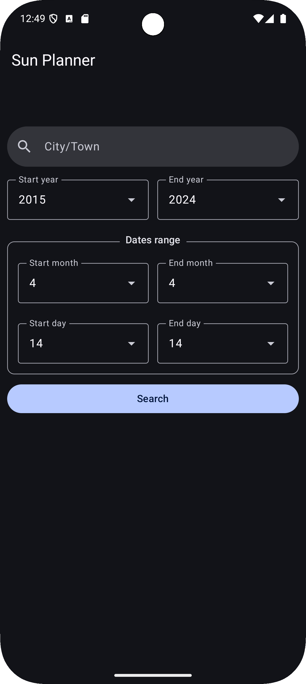
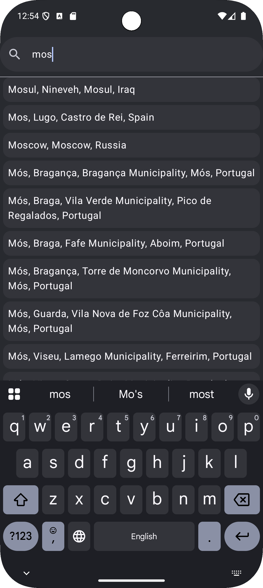
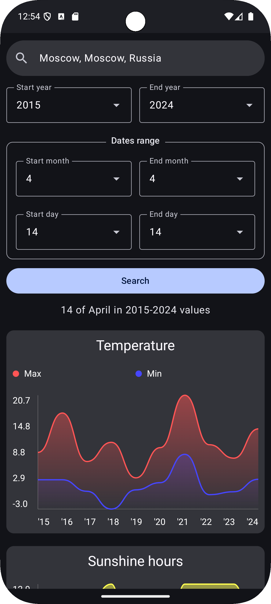
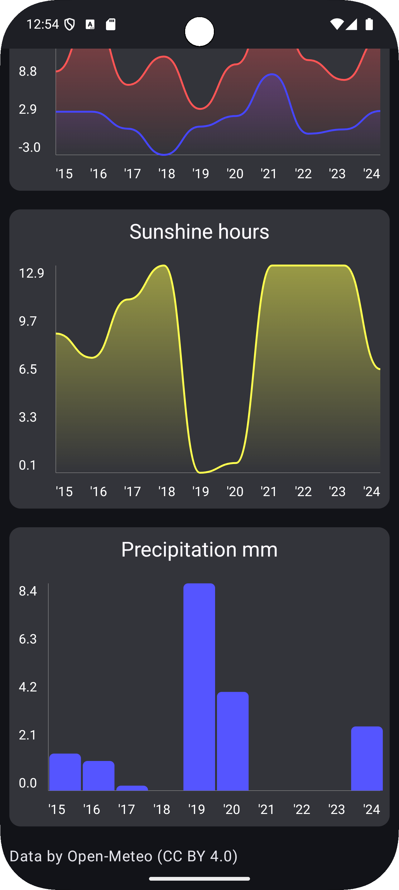

<h1 align="center">🌞 SunPlanner</h1>

SunPlanner is an app for planning and analyzing weather conditions that helps you choose the best time for a vacation or an important event.

Weather data by [Open Weather](https://openweathermap.org/) 
---

📌 Main Features:

✅ Retrieve weather data for a selected period: temperature, precipitation, and other parameters.  
✅ Calculate average temperature and precipitation by day and year.  
✅ User-friendly interface for entering city and date ranges.  
✅ Support for various time intervals for flexible analysis.  

## Screenshots

<table>
  <tr>
    <td></td>
    <td></td>
  </tr>
  <tr>
    <td></td>
    <td></td>
  </tr>
</table>

📥 **Installation**  

🔹 **Via [Obtainium](https://github.com/ImranR98/Obtainium)**  
Obtainium is an app that allows automatic APK updates from GitHub. If you have Obtainium installed, add this repository to keep TaxiLog up to date.  

🔹 **Alternative method**  
1. Go to the [Releases](https://github.com/HSact/SunPlanner/releases) section.  
2. Download the latest APK version.  
3. Install it on your device.  

---

<h1 align="center">🌞 SunPlanner</h1>
SunPlanner — это приложение для планирования и анализа погодных условий, которое поможет вам выбрать наилучшее время для отдыха или важного события.

---

📌 Основные возможности:

✅ Получение данных о погоде за выбранный период: температура, осадки и другие параметры.  
✅ Средние значения температуры и осадков по дням и годам.  
✅ Интуитивно понятный интерфейс для ввода города и дат.  
✅ Поддержка различных временных интервалов для анализа.  

📥 Установка

🔹 Через Obtainium
Obtainium — это приложение для автоматического обновления APK с GitHub. Если у вас установлен Obtainium, добавьте этот репозиторий и получайте обновления автоматически.

🔹 Альтернативный способ

Перейдите в раздел [Releases](https://github.com/HSact/SunPlanner/releases).

Скачайте последнюю версию APK.

Установите на своё устройство.
