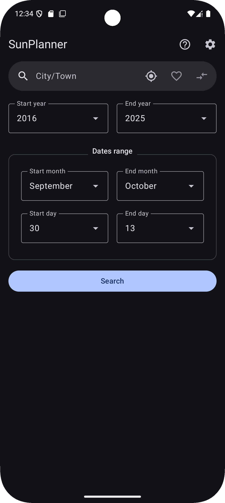
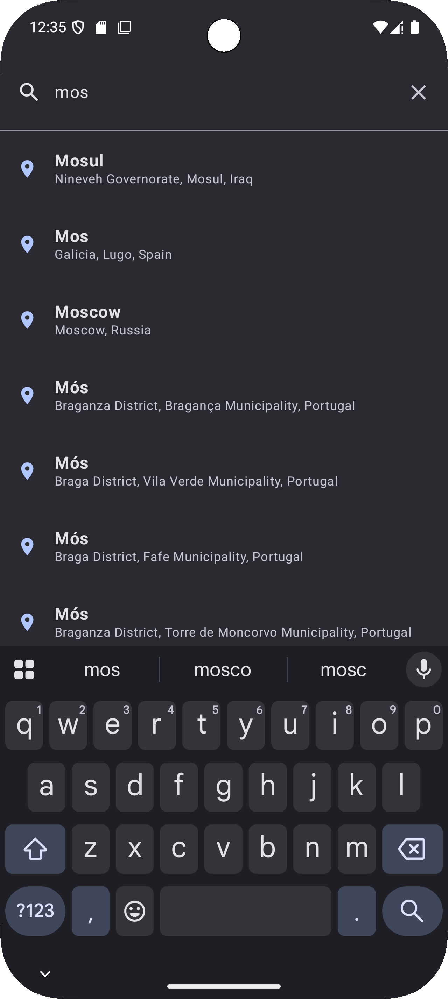
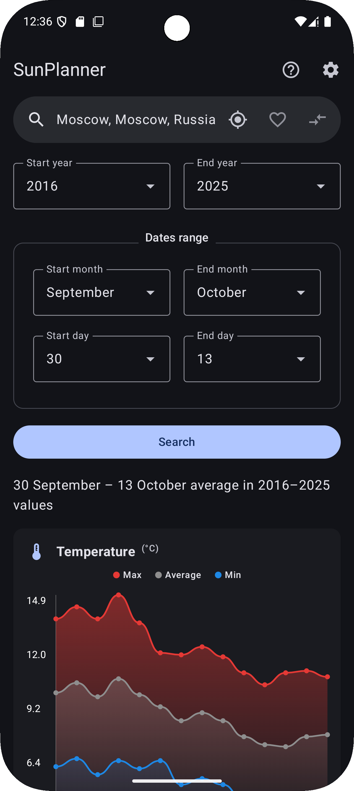
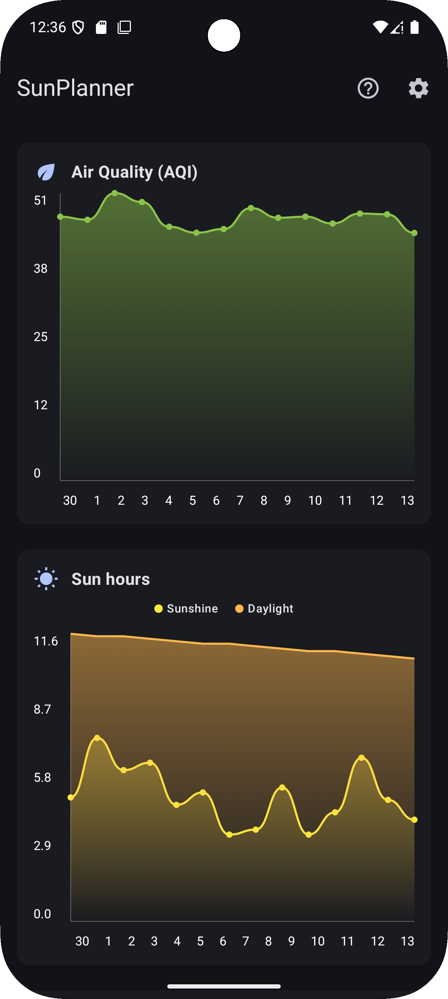
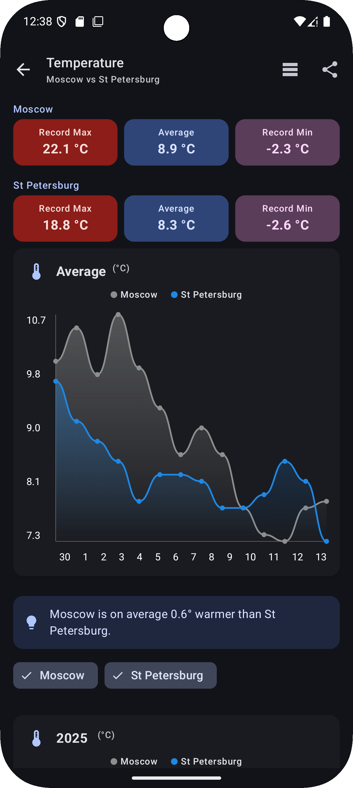
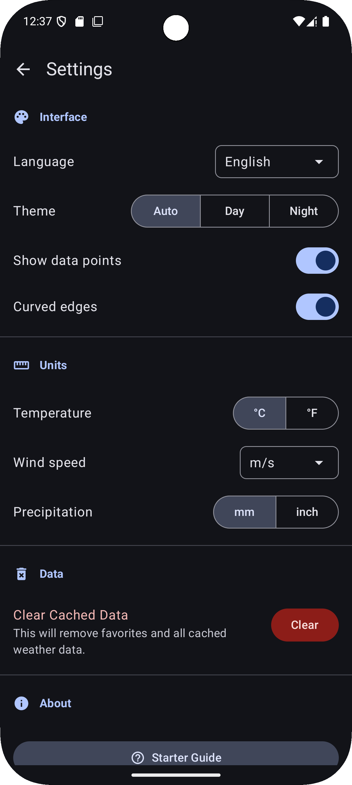
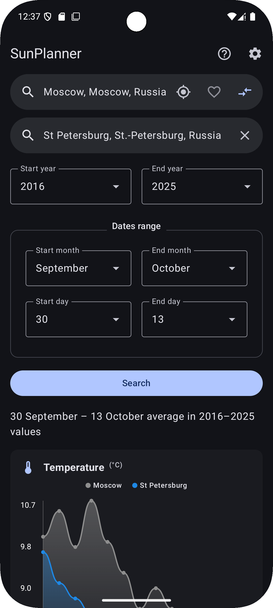
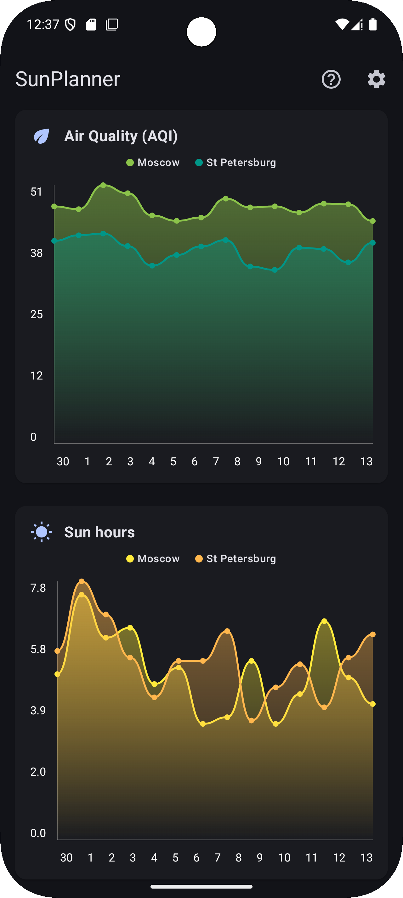

<h1 align="center">🌞 SunPlanner</h1>

SunPlanner is an app for planning and analyzing weather conditions that helps you choose the best time for a vacation or an important event.  
Weather data by [Open-Meteo.com](https://open-meteo.com/) 
Graphs by [ComposeCharts](https://github.com/ehsannarmani/ComposeCharts) 

---

## 📌 Main Features 

🌦️ Weather for a selected day or period: temperature, precipitation, cloudiness, etc. 
📊 Weather statistics: average temperature and precipitation by day and year 
📅 Weather log: convenient viewing of data by day and year 
🧭 Simple interface: enter the city and the desired dates 
🔁 Support for various time intervals 

## 🧱 Tech Stack

- **Language:** Kotlin  
- **UI:** Jetpack Compose  
- **Architecture:** MVVM with MVI-style state management  
- **State Handling:** StateFlow + sealed `UiState`  
- **Dependency Injection:** Hilt  
- **Networking:** Retrofit + Kotlinx Serialization
- **Data Storage:** Jetpack DataStore
- **Charts:** [ComposeCharts](https://github.com/ehsannarmani/ComposeCharts) 
- **Data Source:** [Open-Meteo.com](https://open-meteo.com/) API (no local database)

## 🧩 Architecture Overview

The app follows a unidirectional data flow:

- ViewModel holds `StateFlow<MainUIState>`
- UI observes and reacts to state changes
- Sealed `UiState` handles loading, success, and error states
- ViewModel uses a use-case layer to abstract API logic

## 📖 Documentation

See the documentation [here](https://hsact.github.io/SunPlanner/).

## Screenshots

| | | | |
| :---: | :---: | :---: | :---: |
|  |  |  |  |
|  |  |  |  |

## 📥 Installation 

🔹 **Via [Obtainium](https://github.com/ImranR98/Obtainium)**  
Obtainium is an app that allows automatic APK updates from GitHub. If you have Obtainium installed, add this repository to keep SunPlanner up to date.  

🔹 **Alternative method**  
1. Go to the [Releases](https://github.com/HSact/SunPlanner/releases) section.  
2. Download the latest APK version.  
3. Install it on your device.  

---

<h1 align="center">🌞 SunPlanner</h1>
SunPlanner — это приложение для анализа истории погоды. Смотри, какая была температура, осадки, облачность и другие параметры в выбранный день или период в любом городе. Приложение собирает данные и предоставляет статистику погоды — удобно для планирования отпуска, свадеб и других мероприятий. 

---

## 📌 Основные возможности 

🌦️ Погода за выбранный день или период: температура, осадки, облачность и др. 
📊 Статистика погоды: средние значения температуры и осадков по дням и годам 
📅 Журнал погоды: удобный просмотр данных по дням и годам 
🧭 Простой интерфейс: введи город и нужные даты 
🔁 Поддержка различных временных интервалов 

## 🧱 Технологии

- **Язык:** Kotlin  
- **UI:** Jetpack Compose  
- **Архитектура:** MVVM с элементами MVI  
- **Состояния:** StateFlow + `sealed` UiState  
- **DI:** Hilt  
- **Сеть:** Retrofit + Kotlinx Serialization
- **Хранение настроек:** Jetpack DataStore
- **Графики:** [ComposeCharts](https://github.com/ehsannarmani/ComposeCharts) 
- **Источник данных:** [Open-Meteo.com](https://open-meteo.com/) API (без локальной БД)

## 🧩 Архитектура

- ViewModel хранит `StateFlow<MainUIState>`
- Компоненты UI подписаны на состояние
- Используются `sealed` классы для представления UI-состояний (`Loading`, `Error`, `Data`)
- Вся логика получения данных инкапсулирована в UseCase

## 📖 Документация

Смотрите документацию [тут](https://hsact.github.io/SunPlanner/).

## Скриншоты

| | | | |
| :---: | :---: | :---: | :---: |
|  |  |  |  |
|  |  |  |  |

## 📥 Установка

🔹 **Через [Obtainium](https://github.com/ImranR98/Obtainium)** — это приложение для автоматического обновления APK с GitHub. Если у вас установлен Obtainium, добавьте этот репозиторий и получайте обновления автоматически.

🔹 **Альтернативный способ** 

1. Перейдите в раздел [Releases](https://github.com/HSact/SunPlanner/releases).
2. Скачайте последнюю версию APK.
3. Установите на своё устройство.
